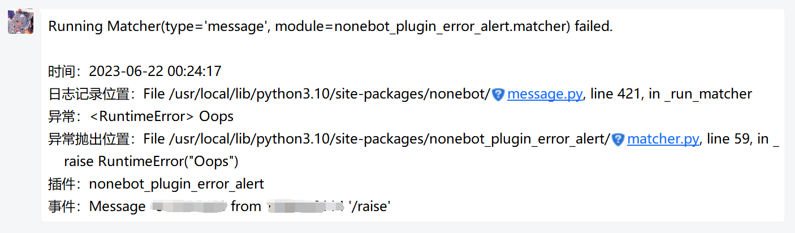

nonebot-plugin-error-alert
========

当Bot发生运行错误时发送消息提醒

## 卖家秀

## 指令

### `/error_alert subscribe`

订阅错误告警。发生错误时立即发送告警至本账号。

### `/error_alert subscribe <cron>`

订阅错误告警。但不会在发生错误时立即发送告警，而是在满足cron表达式的时间点统一发送该时间段发生的错误告警。

### `/error_alert unsubscribe`

取消订阅错误告警。

## 配置项

### `error_alert_superuser_only`

是否仅允许超级用户调用指令。

默认值：`True`

## LICENSE

MIT License